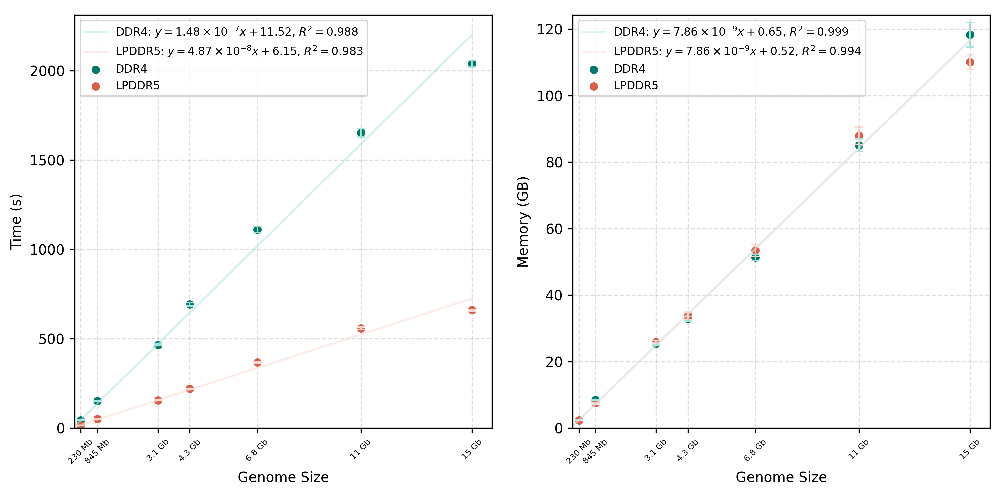
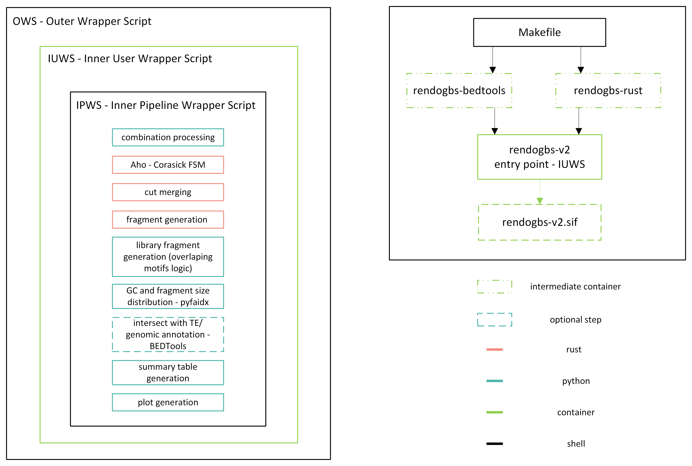

rendogbs pipeline
=================

**rendogbs** is a reproducible pipeline for designing and evaluating 
restriction enzyme combinations for double-digest RAD sequencing (ddRAD) 
library preparation.

Given a reference genome, rendogbs predicts the restriction fragments 
produced by a chosen enzyme combination, filters them by the fragment size 
window used in your library preparation protocol, and reports fragment 
abundance, length distribution, GC composition, and (optionally) overlap 
with gene and transposable element annotations. Multiple enzyme combinations 
can be evaluated in one run, enabling fast comparison of
candidate combinations before committing to a wet-lab protocol.

- Predicts and evaluates restriction fragments for any of **14,040 offered
  enzyme combinations** (171 supported enzymes)
- Reports fragment abundance, length distribution, and GC composition
- Optional gene (GFF/GTF) and transposable element (RepeatMasker/EDTA/TETools) 
  annotation overlap
- Compares multiple enzyme combinations in a single run
- Fully containerized (Docker or Apptainer formerly Singularity) for reproducible, 
  platform-independent results
- HPC-support - supports PBS scheduler
- Modular, CSV-based intermediate outputs for 
  downstream reuse
- **Fully automated analysis and plotting** - results are ready to browse 
  as TSV tables (for Excel) and as auto-generated figures

For more detailed informations see: [`Core_Architecture.md`](./Core_Architecture.md) and 
[`wrapper_architecture.md`](./wrapper_architecture.md).

Requirements
------------

- Unix-like environment (Linux or macOS)
- make
- docker

Building / Installation
-----------------------

Clone the repository and move into it:
```sh
   git clone https://github.com/Magn3zy/rendogbs.git
   cd rendogbs
```

To build the Docker image locally, just type:

```sh
make
```

The build process builds a Docker image named `rendogbs-v2` locally as
the default make target is `docker`. The image is built from supplied
`Dockerfile` in the root of this repository.

To build an Apptainer (formerly Singularity) image, use the `sif`
target:

```sh
make sif
```

This creates the `rendogbs-v2.sif` file.

It is possible to build both Docker and singularity image by using the
`all` target, however as the singularity image is built from the
Docker image, it basically performs the same operations as the
`sif` target:

```sh
make all
```

To remove all built images and build artifacts, use:

```sh
make clean
```

Running
-------

To run the Docker image a wrapper script is provided:

```sh
sh rendogbs.sh [ARGS]
```

Or alternatively:

```sh
sh rendogbs.sh --docker [ARGS]
```

The wrapper script uses Docker by default. It is possible to make it
run the Apptainer container `rendogbs-v2.sif` in current directory. As
the container is built in the root of this repository, the following
suffices:

```sh
sh rendogbs.sh --apptainer [ARGS]
```

For backwards compatibility, the following works as well:

```sh
sh rendogbs.sh --singularity [ARGS]
```

Running the wrapper script with the `--help` argument will print usage
instructions:

```sh
sh rendogbs.sh --help
```

Make sure you read the usage instructions and understand all the
options. Although the pipeline makes best effort to do the right
thing(TM) and report any issues as specifically as possible, it is
important to understand how it is designed and which resources it
leverages. See the minimal example below for a start as well.

Running Examples
----------------

For all the examples we assume a `run2` subdirectory in the current
directory will be used as a workdir and the `data` subdirectory will
contain a reference file `GCF_000001735.3_TAIR10_genomic.fna.gz`. All
the examples will run 5 parallel threads and use size 200-400.

### Running the Docker Image

Using the wrapper script, it is pretty straightforward:

```sh
sh rendogbs.sh --ref ./data/GCF_000001735.3_TAIR10_genomic.fna.gz --workdir ./run2 --parallel 5 --size 200-400
```

### Running the Apptainer (formerly Singularity) Image

The wrapper script handles all of the differences Apptainer brings:

```sh
sh rendogbs.sh --apptainer --ref ./data/GCF_000001735.3_TAIR10_genomic.fna.gz --workdir ./run2 --parallel 5 --size 200-400
```

### Running the Docker Image Manually

It is possible, but **strongly** discouraged, to run the Docker image
manually.

For Docker both the working directory and any and all files used by
the pipeline must be mapped as overlay volumes using the `-v`
option. It is advisable to bind the source files directly into the
runtime directory `/home/rendogbs` inside the container. When the
container terminates it should be removed by the `--rm` option. A full
example equivalent to the above examples would be:

```sh
docker run \
  -v ./GCF_000001735.3_TAIR10_genomic.fna.gz:/home/rendogbs/GCF_000001735.3_TAIR10_genomic.fna.gz \
  -v ./run2:/home/rendogbs/run2 \
  --rm \
  rendogbs-v2 \
  --ref ./GCF_000001735.3_TAIR10_genomic.fna.gz \
  --workdir ./run2 \
  --parallel 5 \
  --size 200-400
```

### Running the Apptainer Container Manually

It is possible, but **strongly** discouraged, to run the Apptainer
image manually. The following guide uses the legacy `singularity`
binary which works both in Apptainer and original Singularity
distribution.

There are two options. The first option is to use the
`SINGULARITY_BIND` environment variable to bind files and directories
inside the container and run the container file directly as it is a
valid executable:

```sh
SINGULARITY_BIND=./run2:/home/rendogbs/run2,./data/GCF_000001735.3_TAIR10_genomic.fna.gz:/home/rendogbs/GCF_000001735.3_TAIR10_genomic.fna.gz \
  ./rendogbs-v2.sif \
    --ref ./GCF_000001735.3_TAIR10_genomic.fna.gz \
	--workdir ./run2 \
	--parallel 5 \
	--size 200-400 
```

As we can see there is no need to bind the whole `data` subdirectory
and it is easier to bind the reference file directly in the
`/home/rendogbs` runtime directory.

The other option is to use the `singularity run` command to provide
the bindings through the `-B` option:

```sh
singularity run \
  -B ./run2:/home/rendogbs/run2 \
  -B ./data/GCF_000001735.3_TAIR10_genomic.fna.gz:/home/rendogbs/GCF_000001735.3_TAIR10_genomic.fna.gz \
  ./rendogbs-v2.sif \
  --ref ./GCF_000001735.3_TAIR10_genomic.fna.gz \
  --workdir ./run2 \
  --parallel 5 \
  --size 200-400
```

These two options are equivalent.


### Running under PBS Workload Manager

The wrapper readily supports running the workflow under the
[OpenPBS](https://openpbs.org/) workload manager. See the `--help`
option for related command-line arguments:

```
PBS SUPPORT
  --qsub                    Do not run directly but submit as PBS job using qsub
  --limits|-l     <limits>  Specify arbitrary PBS job limits (typically mem=XXgb)
  --interactive|-I          Run as interactive PBS job
  --name|-N         <name>  Specify PBS job name (defaults to rendogbs)
```

When `--qsub` is used, the value of `--parallel` option is used to
also request given number of cores using the `-l ncpus=XX` option. See
your PBS installation documentation for more information.

Currently only the `--signularity`/`--apptainer` variant is supported
under PBS:

```sh
sh rendogbs.sh \
  --qsub \
  --limits mem=16gb \
  --singularity \
  --ref ./GCF_000001735.3_TAIR10_genomic.fna.gz \
  --workdir ./run2 \
  --parallel 5 \
  --size 200-400
```

The wrapper takes care of expanding any user paths used to ensure they
can be resolved on the worker nodes.

Argument guide
--------------

> [!TIP]
> Parallelization is performed per enzyme combination. 
> Setting `--parallel` higher than the number of combinations you are 
> running will not speed up the run. 
> For best performance, set the thread count to be equal or 
> alternatively less than the number of combinations in the run.


### Getting help

Rendogbs ships with three separate help commands, depending on what you need:

- `-h`, `--help` — general usage and argument reference (shows the commented 
  file structure used by the pipeline).
- `--enzymes` — full list of supported restriction enzymes (171), needed if 
  you want to build your own custom enzyme combination via `--combinations-file`. 
  Use the exact names listed here when specifying custom combinations - we've 
  tried to use the most common/recognizable name for each enzyme.
- `--fast-combinations` — list of common running enzyme 
  combinations used by `--combinations fast` (the default).

```bash
sh rendogbs.sh --help
sh rendogbs.sh --enzymes
sh rendogbs.sh --fast-combinations
```

### Allowed enzyme combinations

Rendogbs supports **14,040 valid enzyme combinations**. Since this is a ddRAD 
tool, two restrictions apply when selecting a custom combination:

> [!WARNING]
> - **No self-combinations** - an enzyme cannot be paired with itself.
> - **No nested recognition sites** - pairs where one enzyme's recognition site 
>   fully contains the other's (e.g. *MseI* `TTAA` contained within *AseI* 
>   `ATTAAT`) are filtered out to avoid nested cutting patterns.

Rendogbs validates all combinations supplied via `--combinations-file` and 
automatically filters out invalid ones (self-combinations or nested 
recognition sites - see above). If no valid combinations remain after 
filtering, the pipeline will end. Check `--enzymes` for the full list of supported 
enzymes and their names before constructing your own combinations.


```
REQUIRED
--ref            <file>   Reference FASTA (.fa / .fasta / .fa.gz)
--workdir        <dir>    Working directory
--parallel       <int>    Combinations processed in parallel per batch, don't use more threads than combinations
--size           <range>  Fragment size window used in library, e.g. 200-400 (both inclusive)
                          Standard 100 bp bins (0-99 .. 900-999 + >=1000) are
                          always reported; filtered.csv retains only fragments
                          within --size-range.
--chroms         <int>    Longest N contigs treated as chromosomes in
                          per-chromosome plots (default: 10)

COMBINATIONS (fast/custom)
--combinations            fast      default most used combinations from literature
                                    you don't need to specify this argument
--combinations            custom    specify combinations yourself
--combinations-file       <file>    specify combinations your csv file
                                    csv formating: header line - enzyme_a,enzyme_b, refer to enzyme list

ANNOTATION (optional)
--annotation     <file>   GFF3/GFF/GTF gene annotation
--te             <file>   RepeatMasker .out TE annotation

PLOT OPTIONS (optional)
--dpi            <int>    Figure resolution in DPI (default: 300)
--skip-plots              Run pipeline only, skip plot generation

HELP
-h, --help                Show help (shows commented file structure used)
--enzymes                 Show available enzymes in this pipeline (171)
--fast-combinations       Show fast combinations used in this pipeline
```


Resource requirements & benchmarking
------------------------------------

Benchmarking was done on following servers:

- (i) Intel S2600WTT, 2 × Intel Xeon E5-2620 v3 (12 cores / 24 threads, 2,40–3,20 GHz), 192 GB DDR4, HDD
- (ii) AMD RYZEN AI MAX+ 395w/ Radeon 8060S, 1 × AMD RYZEN AI MAX+ (16 cores / 32 threads, 3,00–5,10 GHz), 128 GB LPDDR5, WD_BLACK SN850X

Results were obtained with 23 combinations running in parallel argument `--paralel 23 --combinations fast` on the following genomes: *Prunus persica* (227.4 Mb), *Panicum miliaceum* (834.7 Mb), *Camellia sinensis* var. *assamica* (3.1 Gb), *Hordeum vulgare* (4.2 Gb), *Secale cereale* (6.7 Gb), *Triticum turgidum* subsp. *durum* (10.5 Gb), and *Triticum aestivum* (14.6 Gb). Each run was benchmarked 100 times using benchmark.sh. Raw data were processed with scripts in the [`performance`](performance) folder and are made available. You can reduce RAM requirements by using less combinations in one run.



Architecture diagram
--------------------

